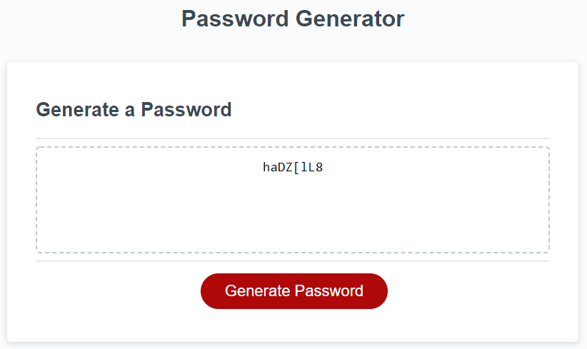

# 03 JavaScript: Password Generator

This application generates a random password based on the following user-selected criteria/requirements. 

## Password Length
The user will be asked to enter the desired length of password (from 8-128 characters, inclusively).

## Character Requirements
Many passwords require numbers, capitalized letters, and/or special characters (such as ! @ # $ %, etc.). This application will ask the user for each of these requirements and the user will respond if their password requires them (or not).

Once all responses are recorded, a password will be generated that passes all requirements and is of the desired character length. 

## The following image demonstrates the application functionality:

 
